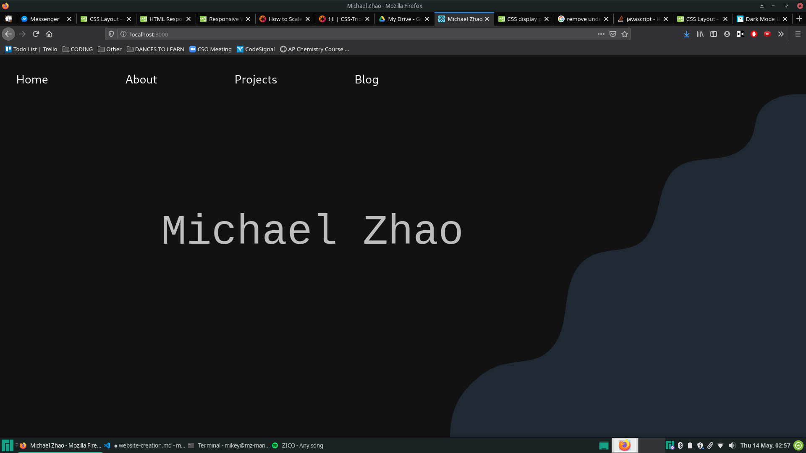

# Creating my Personal Website

## 5/5/20 | First Day

### Code Setup

First step of the process was getting up a framework. For this, I wanted to use React.js with Node.js. First, I used `npx` to create a basic file structure:

```bash
npx create-react-app [appName]
```

This generated a rather ugly file structure, so the rest of the day was spent cleaning up the file system and removing a lot of the excess files.

**Routers** have been discovered :DDD. I'm adding it to create the multiple pages I have (hope it works!). Here's the link to the Tutorial page: [React Routers](https://www.tutorialspoint.com/reactjs/reactjs_router.htm)

### Design

I drew up a basic outline of the first iteration of the website, which would obviously be improved upon, but it's not bad for a first design:


A lot of the day was spent coming up with ideas for designing the webpage and logo for my website. Here's a list of helpful links that I can reference if needed:

- [The Definitive guide to Dark theme UI Design](https://uxdesign.cc/dark-mode-ui-design-the-definitive-guide-part-1-color-53dcfaea5129)
- [Dark theme color palettes](https://colorhunt.co/palettes/dark)
- [Cool website designs](https://www.webdesign-inspiration.com/?device=mix)
- [Website Design Tips for when you get stuck lol](https://websitesetup.org/website-design-ideas/)
- [CSS Scroll Animations](https://cssanimation.rocks/scroll-animations/)
- [Awwwards - really good websites](https://www.awwwards.com/websites/)
- [Amazing, interactive website](https://bruno-simon.com/)

Here's the initial design of the logo I drew up in Photoshop. I like the colors and gradient; kinda very iffy on the design though


### Reflections

I am going to focus on creating routing between pages and getting a working blog system up first before I do the main page. A bit of CSS is probably going to be needed to make the blog look nice, but we're going for MINIMAL on the blog. The front page I want to be interactive in some sense (WebGL????) even to the point of a game :OOOO????? Overall, nothing drastically difficult has come up; it's just been me thinking of ideas and learning react :DDD

### TODO

- Make new icon (TODO: Change logo.svg)
- ~~Create routing system~~
- Create framework for blog
- ~~Still clean up file system~~

## 5/10/20 | Routing

### Routing

Today's big task was creating a routing system that would switch between the 4 pages that I have: Homepage, About, Projects, and Blog. I used `react-router-dom` to do this. All of the pages are now in their own respective folders, and the next goal is to create css for the header.

## 5/12/20 | CSS R&D

### Research

I've listed a few ideas below for what I want to include in terms of CSS on my website:

- [Scroll Animations](https://cssanimation.rocks/scroll-animations/) - Elements will load in an animated style and unload with a transition when the user scrolls them into/out of frame
- [Dark Mode](https://uxdesign.cc/dark-mode-ui-design-the-definitive-guide-part-1-color-53dcfaea5129?gi=b0edf9ba0bf6) - Some sort of dark theme for my website would be cool; idk if I want to base it off of material theme just yet but I think a darker front page would look good
- Sticky top that has moves up when the page is scrolled but blends in initially

Someone (me) forgot how to use CSS!!! So here are just some links to helpful resources when I start adding CSS:

- [Layout (Horizontal/Vertical Alignment)](https://www.w3schools.com/css/css_align.asp)
- [Position property](https://www.w3schools.com/css/css_positioning.asp)

### TODO

- Update manifest.json

## 5/14/20

### More CSS things to consider

- [Responsive Web Design](https://www.w3schools.com/css/css_rwd_intro.asp)
- Mobile-First design (Design smth that works well on mobile FIRST)
    - Important bc ppl like looking at stuff on their phones
    - Use viewport & media queries to do this!!!
- [Scaling SVGs](https://css-tricks.com/scale-svg/)

### Coding!

I added very primitive CSS (lol super messy) and added my own svg graphic for a cool pattern in the corner (may or may not keep it depending on more graphics to come in the future :O) The overall theme will be some form of dark theme, but I don't know exactly what color scheme I should choose. IT IS VERY UGLY RN DON'T COME AT ME!!!



### TODO

- Make new icon
    - logo.svg
    - favicon.ico
    - manifest.json
- Create framework for blog

## 5/17/20

### Research

- [Add sass](https://create-react-app.dev/docs/adding-a-sass-stylesheet)
- [Add bootstrap](https://create-react-app.dev/docs/adding-bootstrap/#using-a-custom-theme)
- [Theming with bootstrap](https://getbootstrap.com/docs/4.4/getting-started/theming/)

### Domain Name Ideas (Avaliable)

- michaelzhao.xyz (GoDaddy - $15/yr)
- mikeyz.com (Google Domains - $12/yr)

## 5/20/20

### Changes

- Added new favicon
- Fixed menu a little?

### Design

- [Website Inspiration](https://www.inboda.com/)
- [Blog Inspiration](http://minimalmonkey.com/)
- I'm using a photo [by JOHN TOWNER on Unsplash](https://unsplash.com/photos/JgOeRuGD_Y4)

### TODO

- CHANGE MENU TO FLEXBOX
    - [Responsive navbar :OOOO](https://www.w3schools.com/howto/howto_js_topnav_responsive.asp)
- REACT BOOTSTRAP (already installed)
    - [Getting Started](https://react-bootstrap.github.io/getting-started/introduction)

## 5/21/20

### Complete Overhaul :DDD

- Background color for landing page: #fee7ea
- LOVE [THIS](http://seanhalpin.io/) WEBSITE
- I am using React-Bootstrap and using this [example](https://codesandbox.io/s/github/react-bootstrap/code-sandbox-examples/tree/master/basic-react-router?file=/src/App.js:701-960) to create my page :))
- Time to learn about [flexbox](https://css-tricks.com/snippets/css/a-guide-to-flexbox/#flexbox-background)!!!!
- We need ANOTHER library: react-router-bootstrap omggggg
- Links + Navbar: this helpful [reference](https://serverless-stack.com/chapters/adding-links-in-the-navbar.html)
- Text color: #F9C784???
